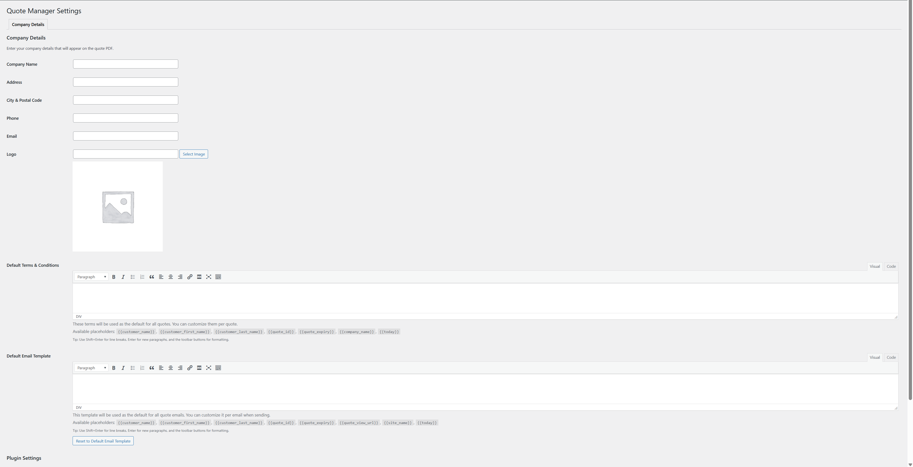

# 🧾 Quote Manager System for WooCommerce
A custom WooCommerce plugin designed to streamline the process of creating, managing, and sharing product quotes with your clients. Empower your business with granular pricing controls, advanced internal metrics, and easy quote generation.

---

## ✨ Key Features

- 🔍 **AJAX Product Search**  
  Quickly search products by their title or SKU for faster quote creation.

- ✍️ **Manual Product Entry**  
  Add custom products or services with full flexibility over pricing.

- 🧾 **Dynamic Pricing Options**  
  Easily manage and display:
  - List Price (Excl. VAT)
  - Discounts (% or fixed)
  - Final Price (Excl. VAT / Incl. VAT)
  - Total Row Calculations.

- 📥 **VAT Toggle**  
  An intuitive toggle to include or exclude VAT rates in quotes.

- 📸 **Custom Product Images**  
  Add images via WordPress Media Library or from external URLs for polished and professional quotes.

- 📄 **Detailed Internal Metrics**  
  View internal-only data, including:
  - Product Cost (Excl. & Incl. VAT)
  - Markup (%)
  - Margin (%)
  - Per-item and total profit summary.

- 📧 **Email Integration**  
  Send quotes directly to customers via email with customizable email templates.

- 📤 **Save and Revisit Quotes**  
  Every quote is saved in the system for easy access and retrieval.

- 📄 **PDF & Print Output**  
  Generate professional and ready-to-print PDFs for quotes.

---

## 🚀 Installation Guide

1. **Download or Clone**  
   Download the plugin from this repository or clone it using Git.

2. **Upload Files**  
   Upload the plugin folder to your `/wp-content/plugins/` directory.

3. **Activate the Plugin**  
   Go to **Plugins > Installed Plugins** in your WordPress admin panel and activate the plugin.

4. **Start Creating Quotes**  
   Navigate to **Customer Quotes > Add New** to build your first quote.

---

## 🛠️ Requirements

- WordPress 5.6 or higher
- WooCommerce 8.0 or higher
- PHP 7.4 or higher (PHP 8.x recommended for better performance)

---

## 🧪 Development and Code Insights

- **Custom Post Type**  
  Quotes are built using a custom post type called `customer_quote`, allowing seamless integration with WordPress infrastructure.

- **Data Persistence**  
  Quote data is stored in post meta, ensuring compatibility with WordPress's core database structure.

- **Tax Calculation**  
  Utilizes WooCommerce helper functions like `wc_get_price_including_tax()` to ensure pricing accuracy. Cost price adjustments and profit margin calculations use the `_wc_cog_cost` meta field.

- **Standards and Extensibility**  
  Adheres to WordPress and WooCommerce coding standards, enabling easy extension and customization.

### 🔧 Potential Code Enhancements
- **PDF Library Options**  
  Explore better alternatives to existing libraries (e.g., [TCPDF](https://tcpdf.org) or [DOMPDF](https://github.com/dompdf/dompdf)) for improved PDF generation performance and styling.

- **Hooks and Filters**  
  Expand the use of WordPress `actions` and `filters` to let developers customize workflows (e.g., modifying email content or dynamic fields).

- **AJAX Enhancement**  
  Implement debounce or rate-limiting mechanisms to optimize AJAX product searches for large WooCommerce stores.

- **REST API Support**  
  Add REST API endpoints to allow integrations with third-party systems.

---

## 📌 Roadmap & Future Enhancements

- 📜 **Quote Logs**  
  Build reporting dashboards to view rejected reason, response time etc.

- 📜 **Advanced Reporting**  
  Build reporting dashboards to view revenue and performance based on saved quotes.

- 🔄 **Integration with WooCommerce Orders**  
  Add the ability to convert a customer quote directly into a WooCommerce order.

---
- 📸 **Plugin Images**
-

## 🧑‍💻 Author

Developed with care by **[Mike Lvd]**. For inquiries or support, feel free to reach out.

---
